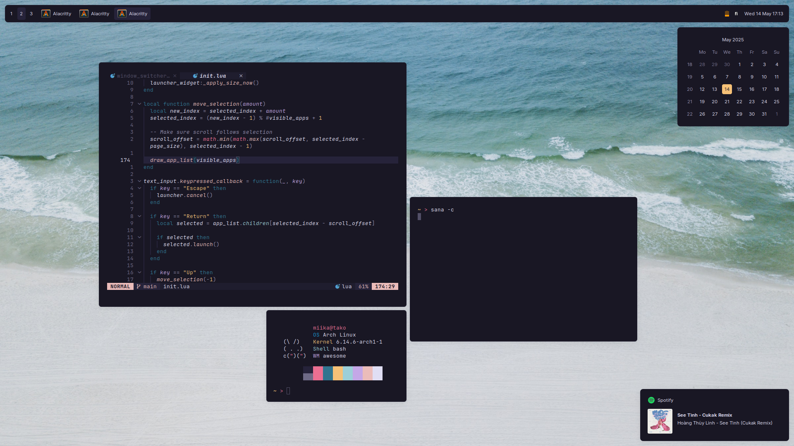
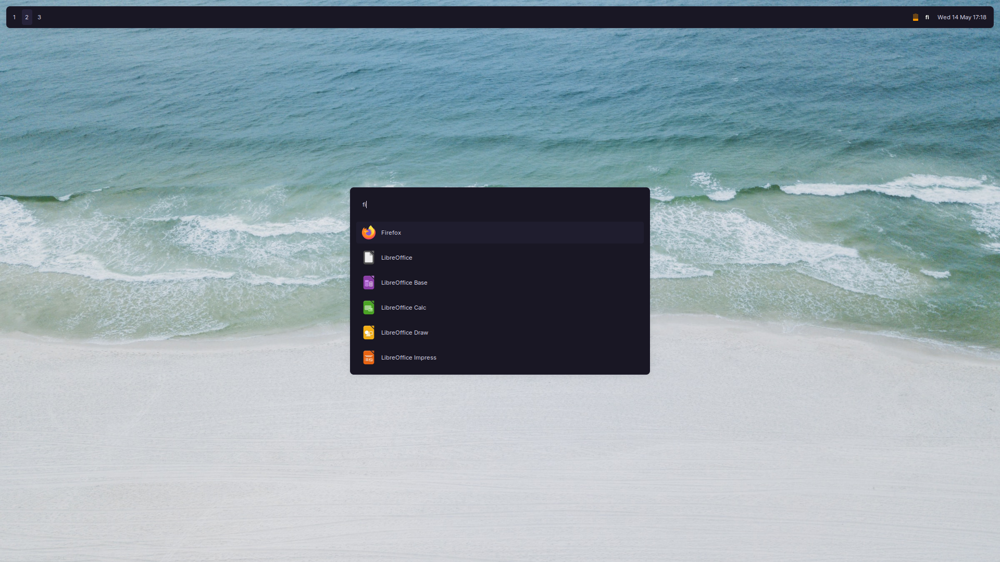
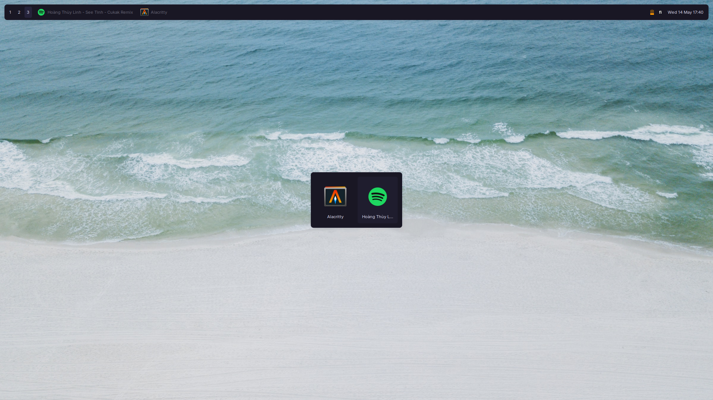
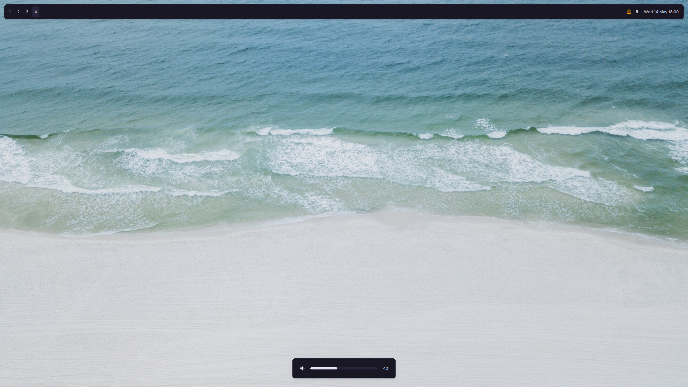

<h1 align="center">myuwi/dots</h1>

A set of configuration files I use on my Linux machines.

## Info

- **OS:** Arch Linux
- **WM:** Awesome
- **Term:** Alacritty
- **Editor:** Neovim
- **Comp:** Picom
- **Fonts:** Inter (UI), JetBrains Mono (Terminal)

## Features

- **Custom Reactive Signal system** - A custom reactive Signal API, inspired by [Preact Signals](https://preactjs.com/guide/v10/signals/) and [SolidJS](https://docs.solidjs.com/concepts/signals), built on top of AwesomeWM.
- Modular widget architecture
- Bar / Panel with modular components (clock, tasklist, etc.)
- App Launcher
- Window Switcher
- Pretty, interactive notifications
- Calendar Popup
- Volume On-Screen Display
- Input Method integration (Fcitx5 + Mozc)

### Signals

This config includes a fully custom declarative Signal API, inspired by modern JavaScript frameworks like [Preact](https://preactjs.com/guide/v10/signals/) and [SolidJS](https://docs.solidjs.com/concepts/signals), built on top of AwesomeWM in Lua.
This lets me write reactive widgets directly within Lua, without needing to worry about any manual state management for most of my UI code.

For example, here the background color of the clock widget is automatically updated whenever the signal `calendar_popup_visible` changes.

```lua
local calendar_popup_visible = signal(false)

-- calendar_popup_visible.value = true / false

local clock_widget = widget.new({
  ...,
  bg = computed(function()
    return calendar_popup_visible.value and beautiful.bg_focus or nil
  end),
  ...
})
```

The signal primitives, `computed(fn)`, `effect(fn)`, and `map(signal, fn)`, automatically track their dependencies within their *tracking scopes*, making them fully reactive without any need for manual dependency tracking.

## Setup

> [!NOTE]
> I don't advice you to straight up just install these configs on your machine, as they are very much adapted to my specific workflow, but feel free to take inspiration.

```sh
$ git clone --recurse-submodules https://github.com/myuwi/dots.git .dots
$ cd .dots

$ just stow
```

## Shots

> Desktop



> Launcher



> Window Switcher



> Volume OSD


