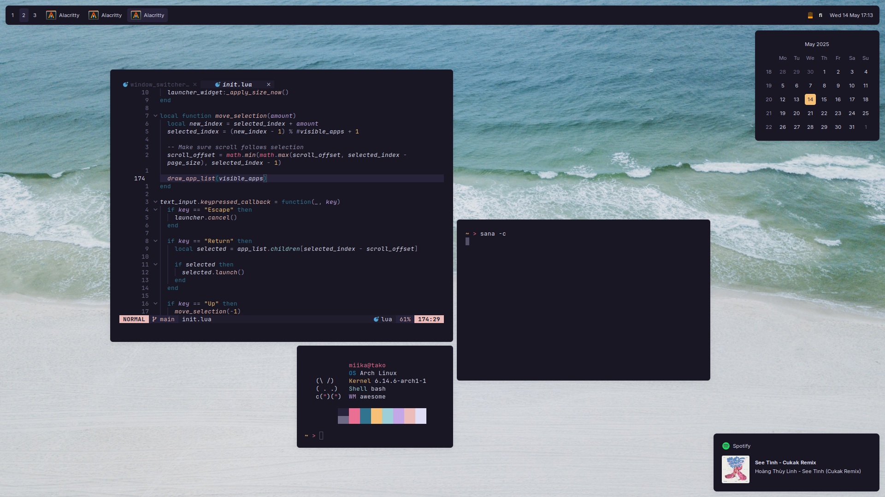
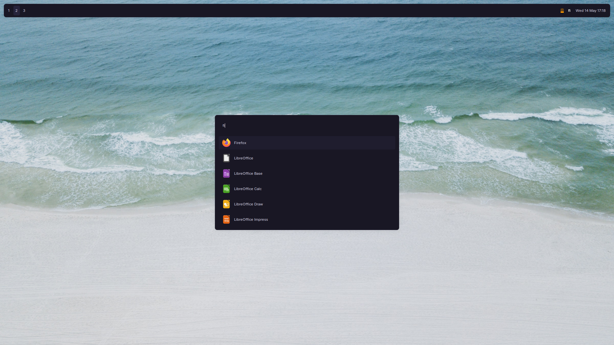
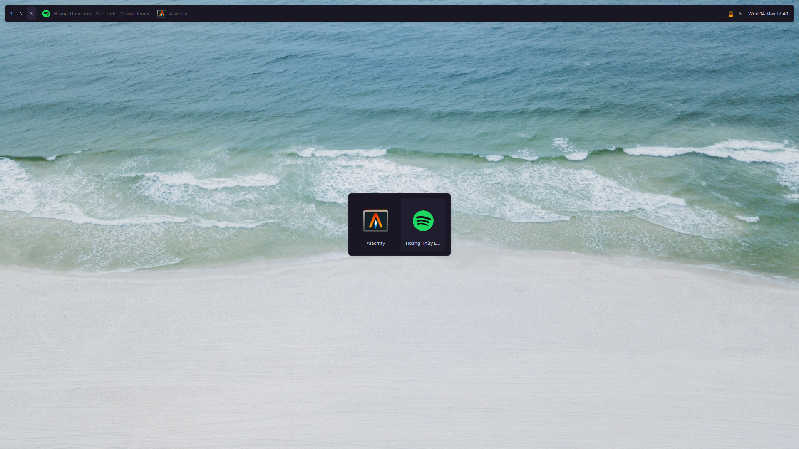
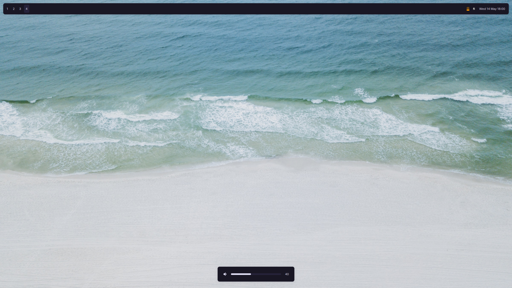

<h1 align="center">myuwi/dots</h1>

A set of configuration files I use on my Linux machines.

## Info

- **OS:** Arch Linux
- **WM:** Awesome
- **Term:** Alacritty
- **Editor:** Neovim
- **Comp:** Picom
- **Fonts:** Inter (UI), JetBrains Mono (Terminal)

## Features

- **[Tide](home/.config/awesome/tide/README.md)** 🌙🌊 - A custom reactive signal-based UI framework inspired by [Preact Signals](https://preactjs.com/guide/v10/signals/) and [SolidJS](https://docs.solidjs.com/concepts/signals), built on top of AwesomeWM
- Modular widget architecture
- Bar / Panel with modular components (clock, tasklist, etc.)
- App Launcher
- Window Switcher
- Pretty, interactive notifications
- Calendar Popup
- Volume On-Screen Display
- Input Method integration (Fcitx5 + Mozc)

## Setup

> [!NOTE]
> I don't advice you to straight up just install these configs on your machine, as they are very much adapted to my specific workflow, but feel free to take inspiration.

```sh
$ git clone --recurse-submodules https://github.com/myuwi/dots.git .dots
$ cd .dots

$ just stow
```

## Shots

> Desktop



> Launcher



> Window Switcher



> Volume OSD


